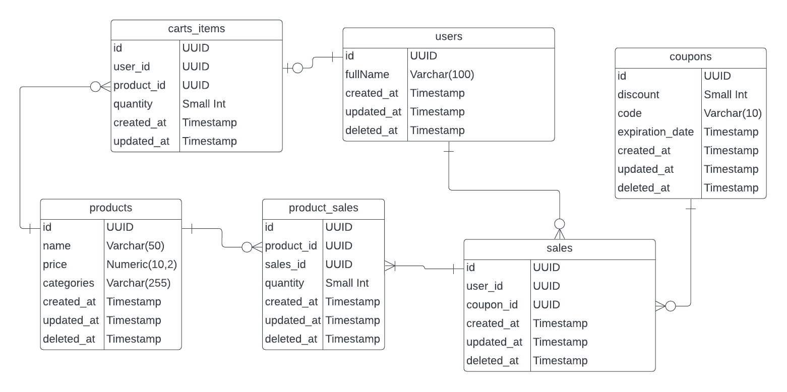

# Database model
For the database, six tables where created to handle all the data of the app: Three master tables and Three transaction tables. The tables are:
  * Master tables:
    - Users
    - Products
    - Coupons
  * Transaction tables:
    - Sales
    - Cart items
    - Products saled

The categories are handled as a string comma separated, because I assumed that was only relevant for filtering purpose.

The ERD is:

# REST API
This app was solved using REST architecture. The folder structure is:
  * `./plugins`: own plugins for Fastify (similar concept of middleware in Express.js).
  * `./Routes`: where all the endpoints are registered. 
  * `./Controllers`: functions to handle a request. Responsible to check and extract data sent to the server to be passed to the services.
  * `./Services`: business logic that interacts with the models to write or read data.
  * `./Models`: sequelize classes to interact with the database.

This architecture is based on the Onion Architecture, trying to break up external interfaces (routes), controllers to check data sent, use cases of data (services), and entities to persist data (models).